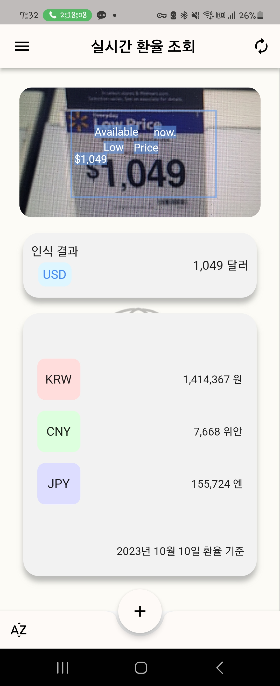
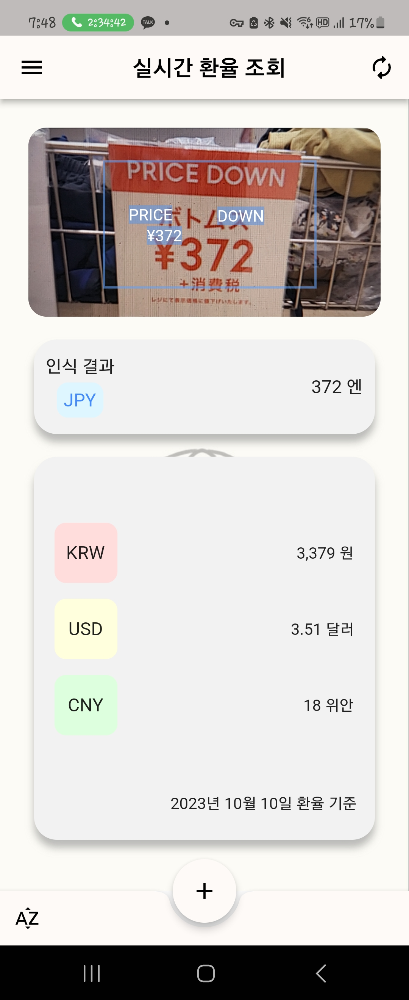
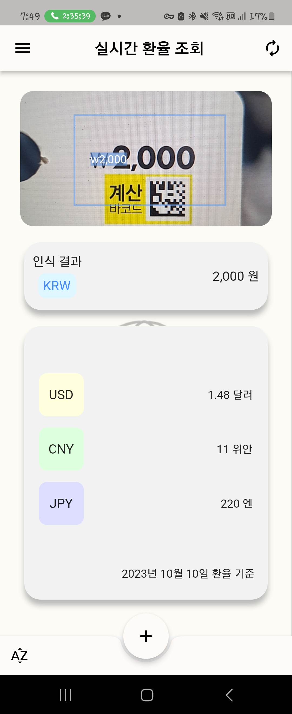
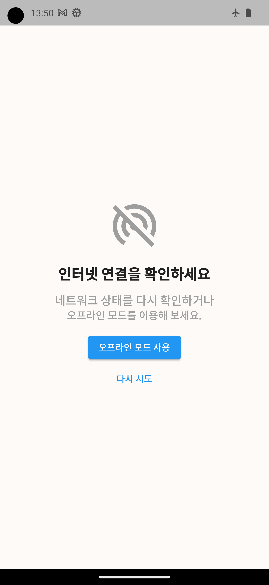
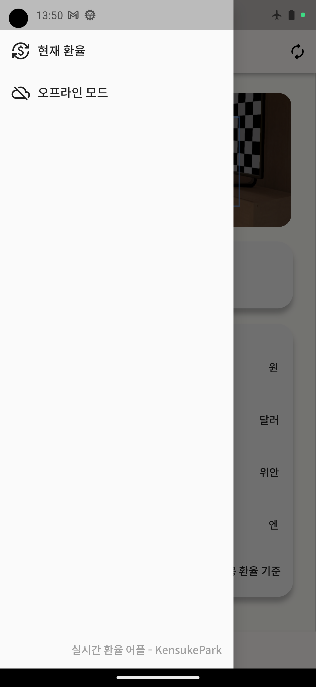
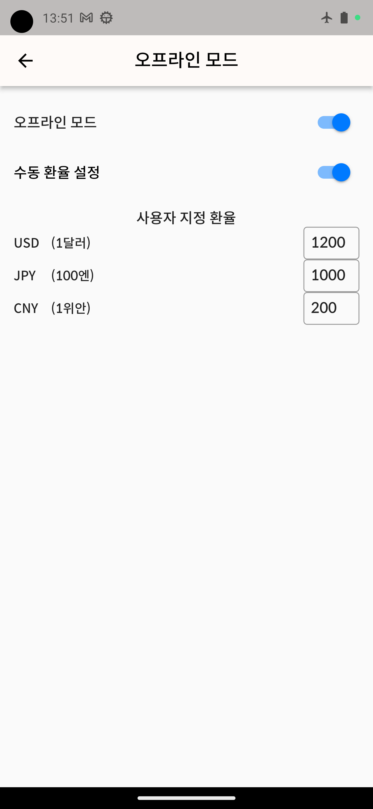
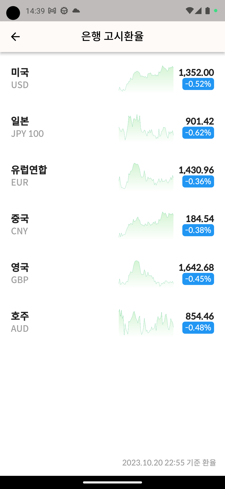
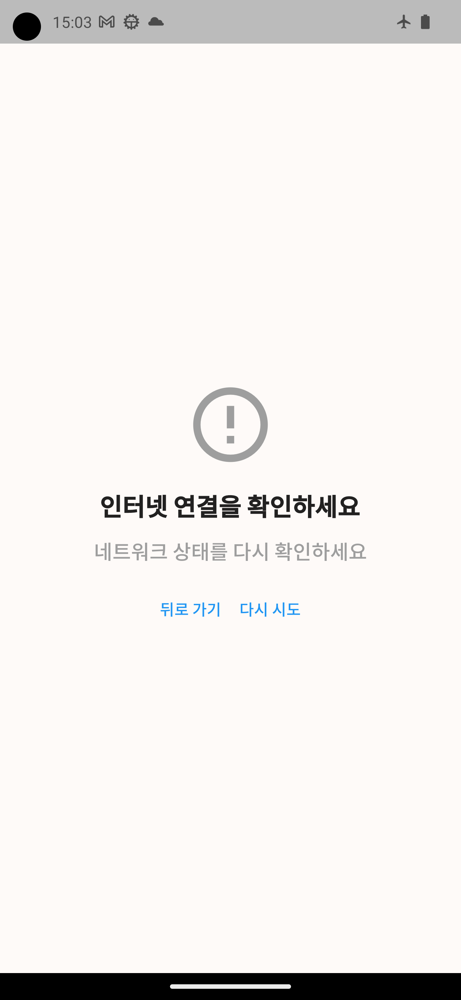
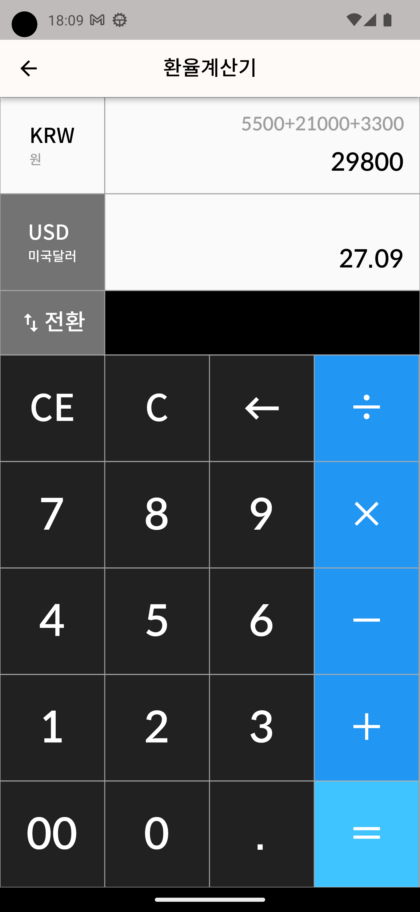

# live_exchange_app
Make App that recognizes price and show other currency's price in real time

# Environment
Android Studio Electric Eel | 2022.1.1 Patch 1  
Flutter 3.10.2  
Dart 3.0.2  

# Preview

# Update
* 2023_10_05  
  기본 UI 구현  
  실시간 카메라 감지 구현  
  최신 환율 연동  

* 2023_10_06  
  타 통화로 환전된 가격 안내 추가  
  텍스트 처리 관련 버그 픽스  

* 2023_10_17  
  오프라인 모드 추가  
  네트워크 상태 확인 추가  
  사용자 설정 환율 모드 추가  

  
* 2023_10_20  
  현재 환율 조회 추가  
  네트워크 상태 확인 v2 추가  

* 2023_10_22  
  환율 계산기 추가  

  
  